# LADY PAC
**LADY PAC** is inspired by coin-operated games, mainly the famous Pac-Man, and takes us back to *the arcade era*. The idea behind the game is simple; *eat all of the pellets while outrunning the ghosts*! The website is targeted toward arcade game enthusiasts and everyone else who is in for a bit of fun.

*Lady Pac* comes with a set of rules, which are featured in the "*how to play*" screen, players can also find all of the instructions regarding game controls and mechanics over there as well. They can win or lose the game, either way, players will receive their score, and with enough skill - be featured on the leaderboard.
They will be able to switch between different players, giving them the option to enjoy the game with their friends and family, driving the competition and increasing the fun.

View live site here - [Lady Pac](https://almost-good.github.io/lady-pac).
  

  
## **Table of Contents**

- [Developer's Note](#developers-note)
- [UX - User Experience Design](#ux-user-experience-design)
  - [Business Objectives](#business-objectives)
  - [User Stories](#user-stories)
- [Visual Design](#visual-design)
  - [Initial Concept](#initial-concept)
  - [Wireframes](#wireframes)
  - [Colour Scheme](#colour-scheme)
  - [Typography](#typography)
  - [Imagery](#imagery)
- [Features](#features)
  - [Existing Features](#existing-features)
  - [Features Left to Implement](#features-left-to-implement)
- [Testing](#testing)
  - [Devices and Browsers](#devices-and-browsers)
  - [Validators](#validators)
  - [Feature Testing](#feature-testing)
  - [User Story Testing](#user-story-testing)
- [Bugs](#bugs)
- [Technologies Used](#technologies-used)
  - [Languages](#languages)
  - [Tools](#tools)
  - [For Testing](#for-testing)
- [Deployment](#deployment)
- [Credits](#credits)
  - [Content](#content)
  - [Images](#images)

## **Developer's Note**
Lady Pac project is created as a **Portfolio Project** for Code Institute Full Stack Software Developer program.
The project showcases my skills in JS, HTML and CSS, which I acquired as a Code Institute student.

Please **note:** This website is created in educational purposes only, it's main purpose is to help me grasp different JavaScript concepts and grow my skills as a developer.

Back to [Table of Contents](#table-of-contents)

## **UX, User Experience Design**

### **Business Objectives**
As the game maker:
1. I want to attract players.
2. I want to provide players fully functional game.
3. I want to provide players with a beautifully designed game that will keep their attention.
4. I want to provide players with means for identification and differentiation between multiple players on the same machine, which will drive competition and thus more players.
5. I want to keep players attention by providing them with a means to progress.
6. I want to enable players to see what went wrong in case of a lost game.
7. I want to provide players with easy navigation that will always land them back to the game.
8. I want players to see the game maker identity so I can gain recognition.

### **User Stories**
As a user:
1. I want a clear sense of what the site is about and how to navigate it
2. I want to be able to view the site and play the game on a device of my choosing.
3. I want to know what the game is about.
4. I want to know how to play the game.
5. I want to be able to set my player identity.
6. I want to be able to play the game again with my current player identity or switch to a new one.
7. I want to know whether I won or lost the game.
8. I want to know how well I scored in the game.
9. I want to know the highest scores achieved.
10. I want to be able to mute or unmute the sounds depending on my preference.
11. I want to know the name of the game maker.
12. I want to have access to the game maker's social media.

Back to [Table of Contents](#table-of-contents)

## **Visual Design**

### **Initial Concept**
The Initial concept for the site is a retro design that will take us back to **arcade era**. The site, while seemingly simple, is full of small details which enrich the design overall. 

### **Wireframes**
Wireframes are created using **Balsamiq** for organizational purposes. They are used for the initial concept only.
  

  

You can find all wireframes here:
- **[Game Screen](assets/docs/wireframes/game-screen.png)**
- **[Enter Player Screen](assets/docs/wireframes/enter-player-screen.png)**
- **[How to Play Screen](assets/docs/wireframes/help-player-screen.png)**
- **[Win Screen](assets/docs/wireframes/win-screen.png)**
- **[Lose Screen](assets/docs/wireframes/lose-screen.png)**
- **[Switch Player Screen](assets/docs/wireframes/switch-player-screen.png)**
- **[Leaderboard Screen](assets/docs/wireframes/leaderboard-player-screen.png)**
 
### **Colour Scheme**
The design for the site is retro arcade, with a deep, dark background and occasional pop of loud color used to brighten the overall experience and take us back to 80s.
  

  

### **Typography**
There are three different font styles used on the page. **Arcade Regular** was selected for most of the page due to its retro pixel-like design, **Karmatic Arcade Regular** for all of the headings and **Pac Font Regular** for game name title, respectfully. I also included websafe fallback fonts, followed by the generic fonts.

### **Imagery**
Images used in the game, as well as logo and favicon were all developed by the site developer.
The design used was simple and clean.
  

  
  
    
  
    
  

Back to [Table of Contents](#table-of-contents)

## **Features**

### **Existing Features**
- **Game screen**
  - **Non-game section**
    - The page starts with the **Lady Pac title** of the game, followed by **high score** display. 
    - The **High score** section displays the highest score ever reached while playing on the current machine. The user can reset the score only if they empty the local storage of the browser. The other way to replace the high score is by beating it.
      - 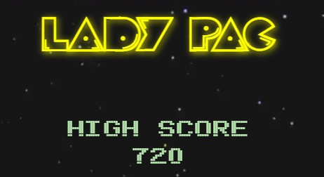
    - **Score** section is dynamically updated while playing the game. It shows how many points the user scored so far in the game.
    - **Lives** section is represented using **heart icons**. Initially, the user starts with two lives but can receive one more life if the score reaches **7000**. This can only happen once. 
    - **Sound icon** serves as sound control and allows the user to mute or play in-game sounds. 
    - **Questionmark icon** opens **help screen**.
    - Score, lives, sound icon and question mark icon are all placed above the gaming area for desktop devices. For smaller screens, they are placed below the gaming area, because in that case gaming area is locked to the top of the screen instead of the bottom.
      - 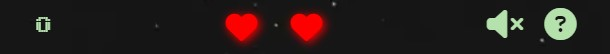
  - **Game section**
    - **Map** 
      - Map section is the gaming area. There are four different map layouts and their order is random. 
      - Map is represented by **walls**, which come in four different colors whose order is random. They are non-interactive elements.
      - Map contains **pellets**, and they are Lady Pac's food. Each pellet is worth 20 points, and the game is won only when all the pellets are eaten.
        - There are special pellets which are called **Energized pellets**.
          - They are worth 50 points and they also give Lady Pac special powers to eat ghosts. Those special powers last only for a limited amount of time.
          - They also need to be eaten for the game to be won.
          - 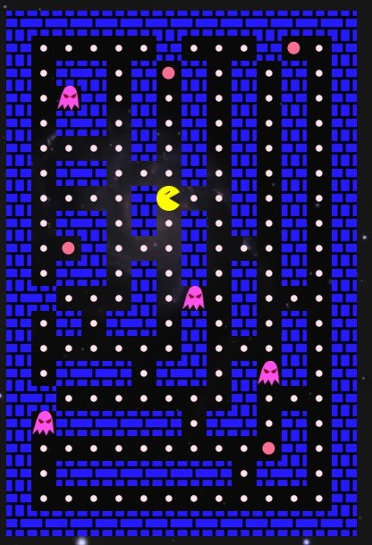
    - **Moving objects**
      - **Lady Pac**
        - Lady Pac is our hero.
        - Her initial movement needs to be initialized, and that triggers ghost movement. She will then continue to move in one direction until she hits wall, or until her movement direction is changed.
        - While she moves, her mouth is constantly opening and closing.
        - Lady Pac movement direction is controlled with either arrow keys or touch swipes. She can register four different directions; up, down, left and right.
        - She can eat pellets, energized pellets and ghosts in their food or switching state. If she tries to eat a ghost in it's normal state, then she will lose a life. With all lives lost, the game is lost.
        - 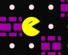
      - **Ghosts**
        - Ghosts are our nemesis.
        - They can also move in four directions, but their same direction movement length and movement direction is random. 
        - Ghosts have five different states:
          - **Normal**
            - Normal ghosts are lethal for Lady Pac, if they come into contact that will result in lost life and potentially in a lost game.
            - 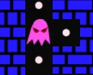
          - **Food**
            - Normal ghosts will become Food ghosts when the energized pellet is eaten. In the food state, the ghost can be eaten as well and is worth 200 points.
            - 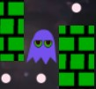
          - **Switching from Food**
            - Food ghosts will become switching ghosts when the time to switch back to normal state is close. They are still harmless, can be eaten and are worth 200 points.
          - **Eaten**
            - Food or switching ghosts will become eaten ghosts when they are eaten. They are now real ghosts, and only their eyes are visible. They are harmless, but cannot be eaten and are not worth points.
            - 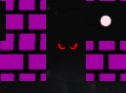
          - **Switching from Eaten**
            - Eaten ghosts will become switching ghosts when the time to switch back to normal state is close. They are still harmless, but cannot be eaten and are not worth points.
    - **Additional game features**
      - **Game cover/uncover state**
        - When the user clicks play/continue, the map is in its covered state, which means the game is paused. To uncover the map, the user needs to click on the map and only then the game will start.
        - When the user clicks outside of the map, the game will become covered once again, and when the game uncovers it will start where it was paused.
        - While the game is covered, game time still goes on. Any active effects from energized pellet can come to the end while the game is covered.
      - **Resize feature**
        - The game can be dynamically resized during the active gameplay or when covered, all objects will keep their positions.
      - **Lock feature**
        - When the game is in a covered state, the user can scroll up and down, but when the game is uncovered, then the map is locked to the screen. For desktop devices it's locked to the bottom and for smaller devices it's locked to the top.
- **Enter player screen**
  - Enter player screen contains the game **logo**, and allows users to enter the **player name** using which they wish to play the game.
  - The user is provided with rules for the naming system. If the user enters an incorrect format, they will be presented with the adequate error message, otherwise, the user can continue to the name confirmation.
    - 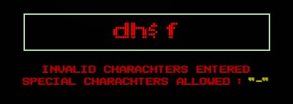
  - **Enter player** screen is displayed automatically when the user first ever visits the website and chooses their name. Otherwise, to access this particular screen and an option to change the player name, the user will have to select **"switch player"** on one of the other screens with that option.
  - 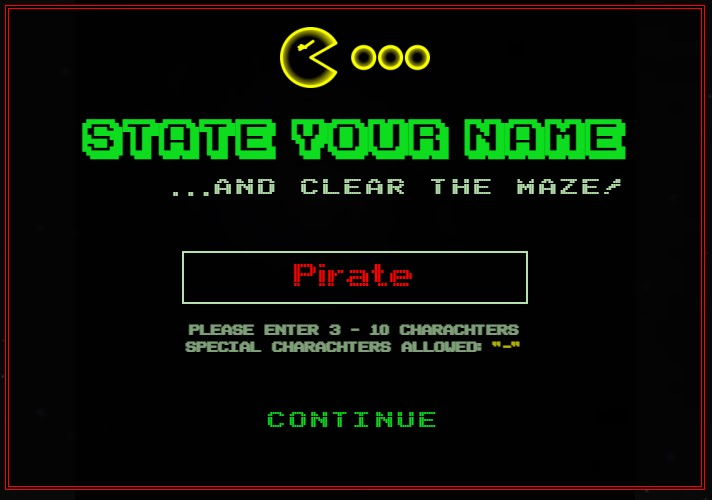
- **Confirm player screen**
  - Confirm player screen serves as a confirmation for the user to play the game using the **displayed name**. 
  - **Displayed name** is either a name that the user just choose to play with or the name that the user was already playing with.
  - The user can continue to play the game using the displayed name, or choose to switch players.
  - **Confirm player** screen is the first screen displayed whenever the user visits the site, except in the case of the first visit ever or if the user never set their player name.
  - 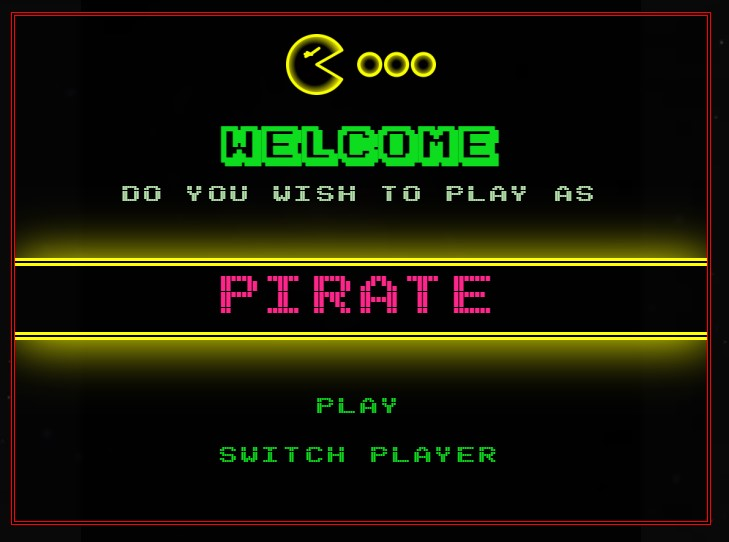
- **Help screen**
  - Help screen contains **objective** of the game, **character list** and **control instructions**.
  - **Objective** section showcases the general purpose of the game.
    - 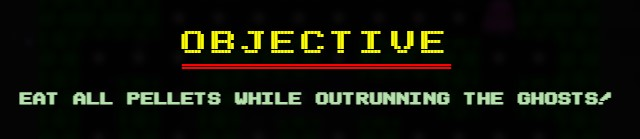
  - **Characters** section contains a list of characters in the game.
    - 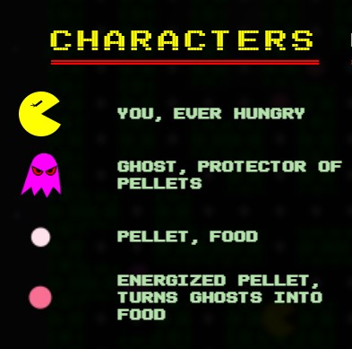
  - **Controls** section contains directions on how to control the game.
    - 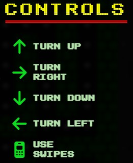
  - After the user has all information they can close the help screen using **okay** button.
- **Win/Lose screen**
  - Win/Lose screen is displayed when the user wins or loses the game. Depending on the result either a win message will be displayed or the lose message.
  - **Win screen**
    - Win screen allows the user to choose between 3 different options.
      - **Continue**
      - **Switch player**
      - **Leaderboard**
    - 
  - **Lose screen**
    - Lose screen allows the user to choose between 3 different options.
      - **Play again**
      - **Switch player**
      - **Leaderboard**
    - 
- **Leaderboard screen**
  - Leaderboard screen displays the top 10 scores achieved on the current machine.
  - **Score list** is ordered from top to bottom, where the highest score is at the top of the list and the lowest at the bottom. In the case of equal scores, the list is ordered alphabetically. If the user score managed to get on the list, the score will be highlighted.
    - 
  - **Your score** section displays the user score, even if the score didn't make it to the top 10 list.
    - 
  - Depending if the game is won or lost different buttons are shown.
    - **Game won**
      - If the game is won, then the score will be displayed under **Your Score**, but will not be added to the leaderboard yet. The score is only added when the game is completely finished, and to achieve that you have to lose or exit the game.
      - User is presented with **continue** and **switch player** buttons.
        - If the user clicks on **continue**, then the next iteration of the game will start, but scores and lives will be kept safe.
        - If the user clicks on **switch player**, user will be continue to **switch player screen**.
        - 
    - **Game lost**
      - If the game is lost, then the score will be added to the leaderboard as well, if it qualifies.
      - The user is presented with **play again** and **switch player** buttons.
        - If the user clicks on **play again**, then the entirely new game will start under the same player name.
        - 
- **Footer**
  - Footer contains the name of the game developer, together with the developer's social links, namely: **GitHub** and **LinkedIn**.
  - 
- **404 page**
  - 404 page is displayed when the site path is not entered correctly or is non-existent.
  - A link is provided to redirect the user back to the main page.
  - The page also features a standard site heading and footer.
  - 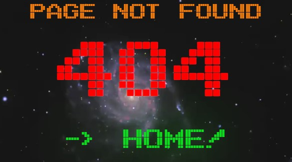

### **Features Left to Implement**
- Dynamic speed change. Currently, the game speed is set at the beginning, but this could be implemented as something to be added in mid-play.
- Fruits. Fruits would deliver more points and make the game more interesting.
- Pathfinding alghoritms. The ghost would be able to target Lady Pac directly, and that will make the game more challenging.

Back to [Table of Contents](#table-of-contents)

## **Testing**

### **Devices and Browsers**

### **Validators**

- [W3C Markup](https://validator.w3.org/nu/)
  - **Index**
    - Completed with no errors.
    - 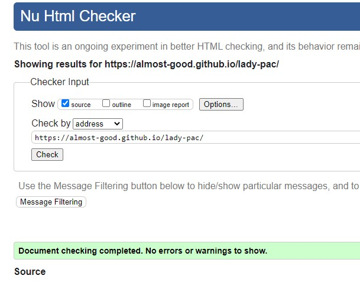
  - **404 page**
    - Completed with no errors.
    - 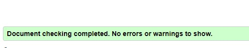

- [W3C CSS](https://jigsaw.w3.org/css-validator)
  - Completed with no errors.
  - There are 7 warnings present due to the use of css variables, and 4 more due to scrollbar styling.
  - 
  - 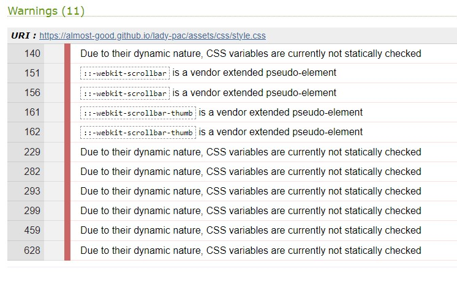
- [Lighthouse](https://developer.chrome.com/docs/lighthouse)
  - **Index desktop**
    - 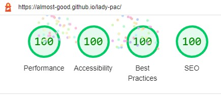
  - **Index mobile**
    - 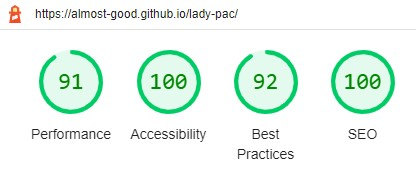

### Feature Testing

### User Story Testing

Back to [Table of Contents](#table-of-contents)

## **Bugs**

Back to [Table of Contents](#table-of-contents)

## **Technologies Used**

### **Languages**
- HTML5 - Used for markup.
- CSS3 - Used to provide styling.
- [JS](https://www.javascript.com) - Used for navigation.

### **Tools**
- [VScode](https://code.visualstudio.com) - Used as the IDE.
- [Git](https://git-scm.com/) - Used for version control.
- [GitHub](https://github.com) - Used for code hosting.
- [Balsamiq](https://balsamiq.com) - Used to create wireframes.
- [Inkscape](https://inkscape.org) - Used to develop in-game icons and logo.
- [FontSquirrel](https://www.fontsquirrel.com) - Used to generate a webfont.
- [Photoresizer](https://www.photoresizer.com) - Used to resize the imgages and to compress them.
- [Colormind](http://colormind.io) - Used to create color palette.
- [Am I Responsive](https://ui.dev/amiresponsive) - Used to create website showcase photo on top of the README.
### **For Testing**

Back to [Table of Contents](#table-of-contents)

## **Deployment**

### The steps to deploy using GitHub pages are:

- Go to the repository on [GitHub](https://github.com).
- Select 'Settings' close to the top of the page.
- Select 'Pages' from the left menu bar.
- Under 'Source' select the 'Branch' dropdown menu and select the **main branch**.
- Once selected, click the 'Save'.
- Deployment will be confirmed by a message saying "Your site is live at" followed by the web address.

### The steps to run the project locally:

- Navigate to the main page of the [GitHub](https://github.com) repository.
- Above the list of files click on green **Code** button.
- Copy the URL for the repository.
- Open **Git Bash**.
- Change the current working directory to specified location.
- Type **git clone** and earlier copied URL.
- Press **enter** to create local clone.

Back to [Table of Contents](#table-of-contents)

## **Credits**

### **Fonts**
All fonts used were sourced from [1001 Fonts](https://www.1001fonts.com).

- **Arcade Regular**
  - by [Pizzadude](https://www.1001fonts.com/arcade-font.html)
- **Karmatic Arcade Regular**
  - by [Vic Fieger](https://www.1001fonts.com/karmatic-arcade-font.html)
- **Pac Font Regular**
  - by [Font-a-licious](https://www.1001fonts.com/pacfont-font.html)

### **Images**
All images used were sourced from [Pexels](https://www.pexels.com).

**[Bg Space image](https://www.pexels.com/photo/galaxy-pinwheel-on-starry-sky-7649118)**

Back to [Table of Contents](#table-of-contents)